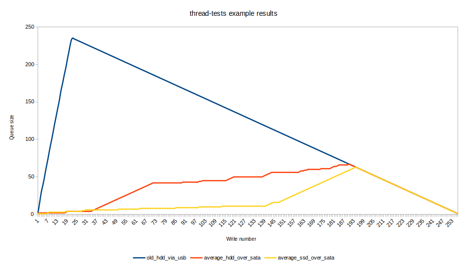

# thread-tests

Job applications am I right guys? (part 2)

## Standard procedure

```shell
git clone https://github.com/IS2511/thread-tests.git
cd thread-tests
mkdir build && cd build
cmake ..
make
```

## Example results

For better results (lol) the .tmp file was removed (if present) before starting

Old HDD via usb:
```c++
Starting threads...
Doing the thing................................................................................................................................................................................................................................................................
Program finished!
Queue sizes on each write: 2 15 29 39 50 62 73 85 96 107 119 130 141 152 165 175 186 196 208 219 230 235 234 233 232 231 230 229 228 227 226 225 224 223 222 221 220 219 218 217 216 215 214 213 212 211 210 209 208 207 206 205 204 203 202 201 200 199 198 197 196 195 194 193 192 191 190 189 188 187 186 185 184 183 182 181 180 179 178 177 176 175 174 173 172 171 170 169 168 167 166 165 164 163 162 161 160 159 158 157 156 155 154 153 152 151 150 149 148 147 146 145 144 143 142 141 140 139 138 137 136 135 134 133 132 131 130 129 128 127 126 125 124 123 122 121 120 119 118 117 116 115 114 113 112 111 110 109 108 107 106 105 104 103 102 101 100 99 98 97 96 95 94 93 92 91 90 89 88 87 86 85 84 83 82 81 80 79 78 77 76 75 74 73 72 71 70 69 68 67 66 65 64 63 62 61 60 59 58 57 56 55 54 53 52 51 50 49 48 47 46 45 44 43 42 41 40 39 38 37 36 35 34 33 32 31 30 29 28 27 26 25 24 23 22 21 20 19 18 17 16 15 14 13 12 11 10 9 8 7 6 5 4 3 2 1
Total time taken: 3.06244
Average time per write: 0.0119626
Average write MB/s: 83.5935
```

Average HDD over SATA:
```c++
Starting threads...
Doing the thing................................................................................................................................................................................................................................................................
Program finished!
Queue sizes on each write: 1 2 2 2 2 2 2 2 2 2 2 2 2 2 2 2 2 3 4 4 4 4 4 4 4 4 4 4 4 4 4 4 4 5 6 7 8 9 10 11 12 13 14 15 16 17 18 19 20 21 22 23 24 25 26 27 28 29 30 31 32 33 34 35 36 37 38 39 40 41 42 42 42 42 42 42 42 42 42 42 42 42 42 42 42 42 42 42 43 43 43 43 43 43 43 43 43 43 44 44 45 45 45 45 45 45 45 45 45 45 45 45 45 45 45 46 47 48 49 50 50 50 50 50 50 50 50 50 50 50 50 50 50 50 50 50 50 51 52 53 54 55 56 56 56 56 56 56 56 56 56 56 56 56 56 56 56 56 56 57 58 58 59 59 60 60 60 60 60 60 60 60 61 61 61 61 61 61 62 63 64 64 65 66 66 66 66 66 66 67 66 65 64 63 62 61 60 59 58 57 56 55 54 53 52 51 50 49 48 47 46 45 44 43 42 41 40 39 38 37 36 35 34 33 32 31 30 29 28 27 26 25 24 23 22 21 20 19 18 17 16 15 14 13 12 11 10 9 8 7 6 5 4 3 2 1
Total time taken: 0.256056
Average time per write: 0.00100022
Average write MB/s: 999.78
```

Average SSD over SATA:
```c++
Starting threads...
Doing the thing................................................................................................................................................................................................................................................................
Program finished!
Queue sizes on each write: 1 1 1 1 1 1 2 3 3 3 3 3 3 3 3 3 3 4 4 4 4 4 4 4 4 4 4 5 5 6 6 6 6 6 6 6 6 6 6 6 6 6 6 6 6 6 6 6 6 7 7 7 7 7 7 7 7 7 7 7 7 7 8 8 8 8 8 8 8 8 8 8 8 8 8 8 8 8 8 8 8 8 8 8 9 9 9 9 9 9 9 9 9 9 9 9 9 9 10 10 10 10 10 10 10 10 10 10 10 10 10 10 11 11 11 11 11 11 11 11 11 11 11 11 11 11 11 11 11 11 11 11 11 11 11 11 11 11 11 12 13 14 15 16 16 16 16 17 18 19 20 21 22 23 24 25 26 27 28 29 30 31 32 33 34 35 36 37 38 39 40 41 42 43 44 45 46 47 48 49 50 51 52 53 54 55 56 57 58 59 60 61 62 63 62 61 60 59 58 57 56 55 54 53 52 51 50 49 48 47 46 45 44 43 42 41 40 39 38 37 36 35 34 33 32 31 30 29 28 27 26 25 24 23 22 21 20 19 18 17 16 15 14 13 12 11 10 9 8 7 6 5 4 3 2 1
Total time taken: 0.27777
Average time per write: 0.00108504
Average write MB/s: 921.625
```

### Graph



### Summary

Everything here might be not true, you are welcome to check and correct

Not much difference between any SATA connected disk, probably because
of caching, small data batches (1MB) and total data size (256MB),
it even could be smaller than disk's total cache size

Mildly interesting are patterns in `Queue sizes`:
- On a slow disk the pattern is easily explained, pushing to queue
  is much faster then writing to disk so we see fast growth of numbers,
  followed by a slow decline at the rate of -1 (for each disk write)
- In the second result there are periodic plateaus visible starting
  from the beginning, they are about 8MB, close to typical
  old and/or low-cost HDD cache sizes. The climb between them is
  not that fast either. One big steady climb is present, I blame weird caching.
  Normal decline at the end, nothing special
- The third result's data shows a big "plateau" like climb in the
  beginning for approx. 140MB, until the disk surrenders and stops caching.
  Now, writing directly, the speed is slower, so the climbing speeds up.
  Default decline at the end
  
`Average write` results seem inaccurate on faster disks because
of good caching
